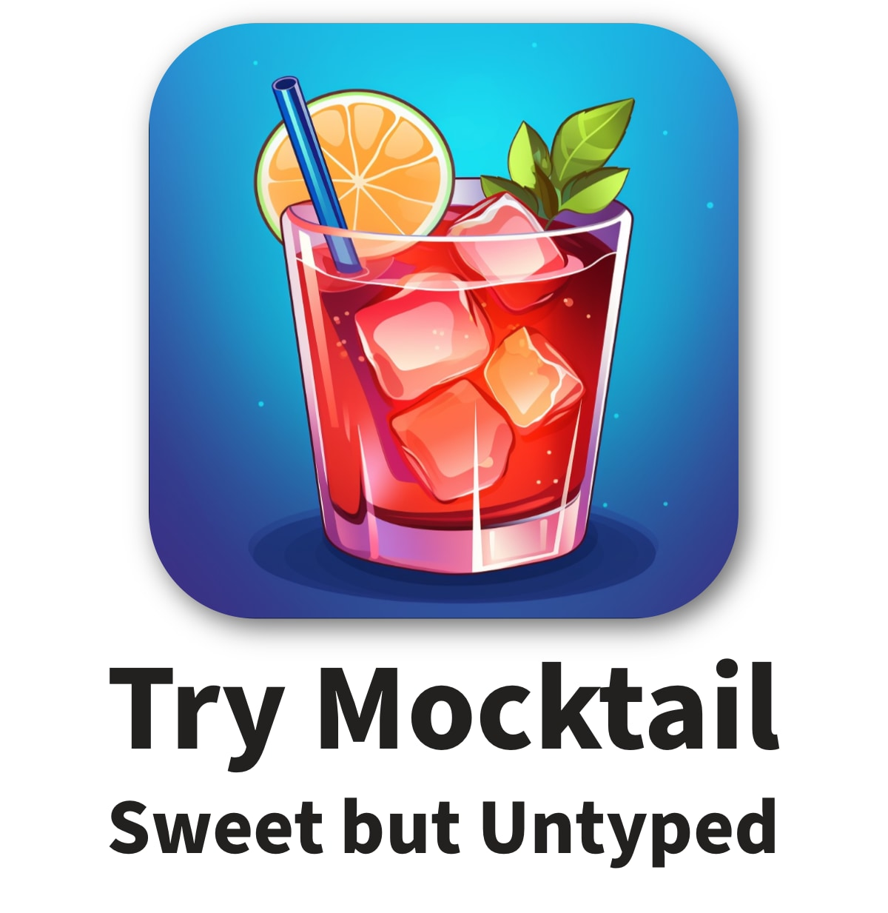
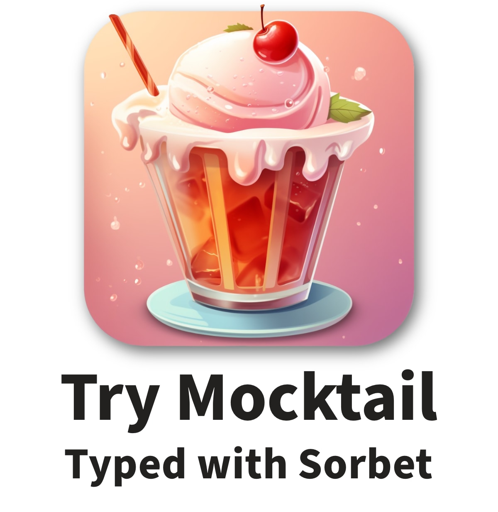

# Mocktail

Mocktail is a mocking library for Ruby built with modern (Ruby 3+) APIs and the
only one with built-in support for type checking with
[Sorbet](https://sorbet.org).  It is designed to facilitate robust test-driven
development of Ruby classes _without_ enabling common mocking mistakes and
abuses that lead to brittle and confusing tests.

Your first choice is a consequential one: how do you want your Mocktail?

  
  

