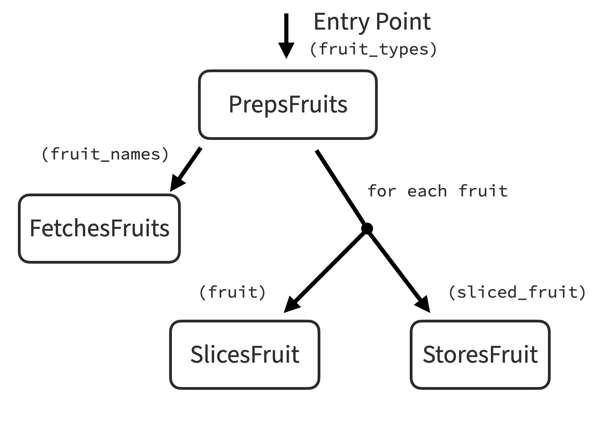
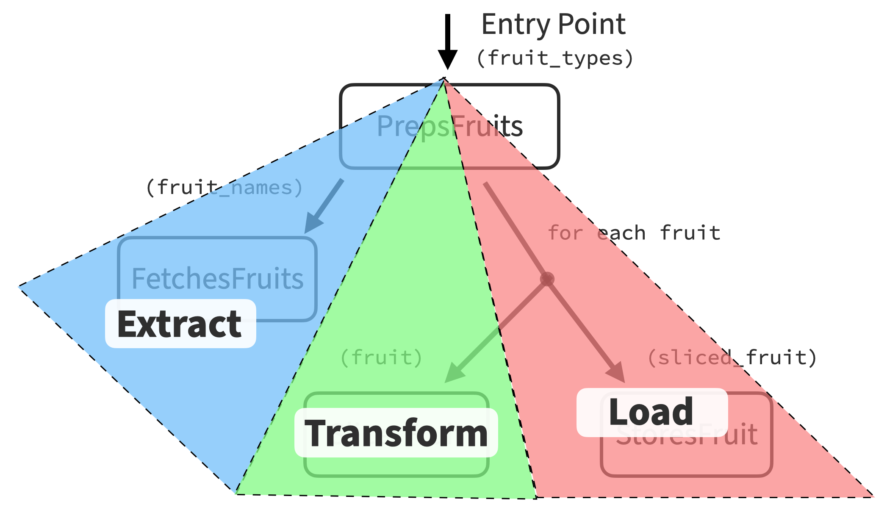

# An example test with Mocktail

As discussed elsewhere, Mocktail's intended use is to facilitate [test-driven development](tdd.md) of [isolated unit tests](support/glossary.md#isolated-unit-testing) by making it trivially easy to achieve isolation
between a [subject under test](support/glossary.md#subject-under-test) and its [dependencies](support/glossary.md#dependency).

## A small example problem: slicing fruit

In order to walk through an example test, we need to dream up a class and method
to implement that is simple enough to condense into example code but realistic
enough to show off the workflow Mocktail was designed to facilitate. And to do
that, it's useful context to start with the end in mind. In a codebase that
was primarily developed with outside-in test-driven development, it's typical
to see the following:

* The average [delegator](support/glossary.md#delegator) has 3 dependencies that
implement logic
* Delegators are typically the only units of code whose tests use [test
doubles](support/glossary.md#test-double), and they tend to simplify their usage
by _only_ delegating as opposed to performing any logic, thereby avoiding [mixed
levels of abstraction](support/glossary.md#level-of-abstraction)
* Because most real-world applications don't exist in a vacuum, a given
entrypoint for a unit of work will typically shake out into a tree of
dependencies that resembles an [extract, transform,
load](https://en.wikipedia.org/wiki/Extract,_transform,_load) process

With that in mind, let's write a test of a delegator that assists in the prep
work before a bar opens: getting fruits from the fridge, slicing them, and
storing them in a prep station.

One way to identify the jobs to be done is to translate a narrative summary of a feature into a list of discrete responsibilities or activities. A class that
manages fruit prep would:

1. Fetch fruits from the stock room
2. Slice each fruit
3. Store each fruit in a prep station

If we were practicing traditional test-driven development, we might start with a
test that jumps into implementing one of these activities and then continue to
add test cases until all the responsibilities are covered. If the subject were
to get too complex as we saddled it with more tasks, we might pause to extract
those responsibilities into single-responsibility sub-units, which would often
necessitate moving test code around or otherwise testing those sub-units only
indirectly through the original subject.

Outside-in test driven development flips the order of operations: once we know
what the subject needs to do, we imagine new subordinate units to delegate the
work to and use our test to specify the relationship between the subject and its
dependencies. We would repeat this process until we were left with a number of
irreducibly simple, single-responsibility units of domain logic that could
largely be implemented via straightforward tests (without mocks), often as pure
functions. This way, simplicity is baked into the process instead of an
afterthought—where classical TDD often succeeds or fails based on the
practitioner's patience and discipline to remember to refactor.

To make this a little clearer, let's illustrate the ordered list above into imagined dependencies that a delegator might need to accomplish the work:

<p align="center" width="100%">
  
</p>

The diagram matches the assumptions of a typical delegator described above: a
subject with 3 dependencies, that does nothing but delegate its responsibility,
and a tree that resembles an extract-transform-load process: something to fetch
data based on a request, something to perform logic, and something to put the
result somewhere.

To visualize what we mean by ETL:

<p align="center" width="100%">
  
</p>

If you're new to isolated TDD, the focus on these heuristics may appear like
arbitrary strictures but in reality are just observations of patterns that
emerge over time when your practice and tools pushes you to the extreme end of
breaking down problems into small, single-purpose functions and methods. The
reason ETL emerges as a common pattern is because a huge proportion of software
features entails getting data via I/O, doing something interesting with that
data, and then putting that data somewhere.

## Initial test setup

Okay, so with that gameplan, let's start writing a test. We will use [dependency
inception](tdd/poro/dependency_inception.md) to get our dependencies in the
hands of our subject using [Mocktail.of_next](support/api.md#mocktailof_next):

```ruby
require "test_helper"

class PrepsFruitsTest < Minitest::Test
  def setup
    @fetches_fruits = Mocktail.of_next(FetchesFruits)
    @slices_fruit = Mocktail.of_next(SlicesFruit)
    @stores_fruit = Mocktail.of_next(StoresFruit)

    @subject = PrepsFruits.new
  end

  def test_prep
    # TODO
  end
end
```

If we run this test, of course it will fail, because none of the things
referenced in `setup` exist yet!  That said, it's important to get in the habit
of running tests early and often to make sure that their message and status
matches our expectations.

```
PrepsFruitsTest#test_prep:
NameError: uninitialized constant PrepsFruitsTest::FetchesFruits
    example.rb:5:in `setup'
```

As they say, the goal of each action in TDD is to "either make the test pass or
change the message", so let's rapidly iterate to overcome each of these errors
until the empty `test_prep` method exits cleanly:

```ruby
class FetchesFruits
end
```

Fails with `uninitialized constant PrepsFruitsTest::SlicesFruit` until we:

```ruby
class SlicesFruit
end #=> message is now: `uninitialized constant PrepsFruitsTest::StoresFruit`

class StoresFruit
end #=> message is now: `uninitialized constant PrepsFruitsTest::PrepsFruits`

class PrepsFruits
end #=> …success!
```

Creating these 4 classes (the subject and its three dependencies) is enough to
get the test to exit cleanly for now.

## Arrange: creating values and configuring stubbings

Each test has three phases: [arrange, act, and
assert](support/glossary.md#arrange-act-assert), and it usually makes the most
sense to start with test setup. Here we'll need to create the
[values](support/glossary.md#value) that our subject will be acting on as well
as the [stubbing](support/glossary.md#stub) configurations for each of its
mocked dependencies.

Like before, we'll rapidly iterate by adding a stubbing, running the test,
making a change, and changing the message. After you get in the flow, driving
the design of a system with outside-in test-driven development starts to feel
like [paint by number](https://en.wikipedia.org/wiki/Paint_by_number).

We'll start by stubbing the first interaction to fetch the fruit. This will
require us to specify some value objects (fruits) we haven't created yet.

```ruby
def test_prep
  fruits = [Lime.new, Mango.new, Pineapple.new]
  stubs { @fetches_fruits.fetch([:lime, :mango, :pineapple]) }.with { fruits }
  # …TODO
end
```

The first error is `uninitialized constant PrepsFruitsTest::Lime`, so let's
start fixing:

```ruby
class Lime
end # message is now: uninitialized constant PrepsFruitsTest::Mango

class Mango
end # message is now: uninitialized constant PrepsFruitsTest::Pineapple

class Pineapple
end
```

After defining `Pineapple`, the next message becomes more interesting!

```
No method `FetchesFruits#fetch' exists for call:

  fetch([:lime, :mango, :pineapple])

Need to define the method? Here's a sample definition:

  def fetch(lime_mango_pineapple)
  end
```

Mocktail can see what we're stubbing and tries to guess the number and name of
arguments based on what we passed in, generating a little method for us. We can
paste that in or we can write our own to clear the error and change the message:

```ruby
class FetchesFruits
  def fetch(types)
  end
end
```

And now we're back to passing! Let's move onto the next stubbing. This one is
much fancier, so look closely:

```ruby
def test_prep
  fruits = [Lime.new, Mango.new, Pineapple.new]
  stubs { @fetches_fruits.fetch([:lime, :mango, :pineapple]) }.with { fruits }
  stubs { |m| @slices_fruit.slice(m.is_a(Fruit)) }.with { |call|
    SlicedFruit.new(call.args.first)
  }
  # …TODO
end
```

This stubbing is taking advantage of two advanced features in Mocktail:

* **Argument matchers -** the [m.is_a](support/api.md#mis_a) matcher allows the
stubbing to do triple-duty and results in the stub being satisfied any time
a `Fruit` instance is passed to `@slices_fruit.slice`
* **Call introspection -** `with` receives an optional
[Call](/src/mocktail/value/call.rb) block param that represents an actual call
of the mocked method by the subject whenever it satisfies the stub configuration

If you're not used to reading Mocktail's API yet, these two stubbings can be
combined to facilitate production code like this:

```ruby
@fetches_fruits.fetch([:lime, :mango, :pineapple]).map { |fruit|
  @slices_fruit.slice(fruit)
} #=> returns [SlicedFruit(Lime), SlicedFruit(Mango), SlicedFruit(Pineapple)]
```

But initially, this will raise a few new errors for us to clear, starting with
`uninitialized constant PrepsFruitsTest::Fruit`. Let's clear it:

```ruby
class Fruit
end

class Lime < Fruit
end

class Mango < Fruit
end

class Pineapple < Fruit
end
```

Here's the next error:

```
No method `SlicesFruit#slice' exists for call:

  slice(is_a(Fruit))
```

So let's go and create one!

```ruby
class SlicesFruit
  def slice(fruit)
  end
end
```

And we're back to passing.

## Act: invoking our subject

Impatient readers will note in frustration that we've created eight classes but
still haven't _even defined the method to be tested_, `PrepsFood#prep`!

Now that our basic stubs are in place, let's invoke that method as our test's
"[act](support/glossary.md#arrange-act-assert)" phase:

```ruby
def test_prep
  fruits = [Lime.new, Mango.new, Pineapple.new]
  stubs { @fetches_fruits.fetch([:lime, :mango, :pineapple]) }.with { fruits }
  stubs { |m| @slices_fruit.slice(m.is_a(Fruit)) }.with { |call|
    SlicedFruit.new(call.args.first)
  }

  @subject.prep([:lime, :mango, :pineapple])

  # …TODO
end
```

As you might expect, the test is telling us to create the method we're here to
implement: `undefined method 'prep' for #<PrepsFruits:0x0000000105008060>`, so
let's make it:

```ruby
class PrepsFruits
  def prep(fruit_types)
  end
end
```

And we're passing again.

That's it! The "Act" phase is usually a one line invocation, because ideally the
subject should be able to do its job being told only once.

## Assert: verifying our interactions

Now that we've completed the Arrange and Act, we can deal with the
[Assert](support/glossary.md#arrange-act-assert) phase of our test.

But how should we assert that the sliced fruit gets stored? None of the code
exists yet, so the assertion we encode into our test will specify the API of the
class responsible for storing fruit. This can make some folks feel a little
queasy, because in the context of traditional TDD, the subject should be a black
box—meaning tests should not be aware of, much less determine the subject's
implementation details. But isolated TDD flips things inside-out: the test
becomes a sounding board for iterating rapidly on the public APIs of not only
the subject, but of the layer of dependencies beneath it. This gives the test
author the opportunity to play with a new API contract (name, parameters, and
return value) via a lightweight
[demonstration](support/glossary.md#demonstration) of a method that doesn't even
exist yet, which means every new method is created through _actual, necessary
use_ instead of being typed into a blank class listing. Letting usage determine
the API confers the same benefits as [readme-driven
development](https://tom.preston-werner.com/2010/08/23/readme-driven-development.html)
by working outside-in and making mistakes cheap to fix. If a method doesn't feel
right, reconfiguring the stubbing in place doesn't require switching files,
renaming references, or moving parameters around. Put differently, if
refactoring is the third step in classical TDD's "red-green-refactor", it's the
_first_ step when practicing isolated TDD. (Prefactoring?)

To illustrate how the assertions we choose can impact the API of our subject and
its dependencies, we're going to show two different ways to finish writing this
test, starting with an approach that verifies a call occurred and finishing with
assertions of a return value from the subject.

### Approach 1: verifying the method was called

One approach would be to verify that `StoresFruit#store` is invoked for each
`SlicedFruit` instance using [verify](support/api.md#mocktailverify). Let's play
that out here.

```ruby
def test_prep
  fruits = [Lime.new, Mango.new, Pineapple.new]
  stubs { @fetches_fruits.fetch([:lime, :mango, :pineapple]) }.with { fruits }
  stubs { |m| @slices_fruit.slice(m.is_a(Fruit)) }.with { |call|
    SlicedFruit.new(call.args.first)
  }

  @subject.prep([:lime, :mango, :pineapple])

  verify { |m|
    @stores_fruit.store(m.that { |sliced_fruit| sliced_fruit.type == Lime })
  }
  verify { |m|
    @stores_fruit.store(m.that { |sliced_fruit| sliced_fruit.type == Mango })
  }
  verify { |m|
    @stores_fruit.store(m.that { |sliced_fruit| sliced_fruit.type == Pineapple })
  }
end
```

Above, we're using another matcher, [m.that](support/api.md#mthat), to ensure
that each `store` was called with one of each type of fruit. (`m.that` takes a
block parameter that receives the actual argument it stands in for, passing the
verification when it returns truthy and failing it otherwise.)

We could have implemented this verification more simply by assigning
`SlicedFruit` instances in the test and stubbing & verifying them by reference.
This would have added another set of variables to track, but would eliminate the
need for using any `m` argument matchers. (The purpose of these docs is to teach
Mocktail's API, so it errs on the side of leaning harder into the library's
features.)

Running our test yields our next error `No method 'StoresFruit#store' exists`.
We can fix that:

```ruby
class StoresFruit
  def store(fruit)
  end
end
```

Finally, this yields an actual assertion failure:

```
Mocktail::VerificationError: Expected mocktail of `StoresFruit#store' to be called like:

  store(that {…})

But it was never called.
```

This is a big deal! It means it's _finally_ time to start implementing the
subject method based on all the decisions driven out by our test so far. We can
write most of these interactions in one fell swoop, because the test setup
already forced us to make most of the decisions of consequence about the code
itself.

Here's how the `PrepsFruit` class might shake out:

```ruby
class PrepsFruits
  def initialize
    @fetches_fruits = FetchesFruits.new
    @slices_fruit = SlicesFruit.new
    @stores_fruit = StoresFruit.new
  end

  def prep(fruit_types)
    @fetches_fruits.fetch(fruit_types).each do |fruit|
      sliced_fruit = @slices_fruit.slice(fruit)
      @stores_fruit.store(sliced_fruit)
    end
  end
end
```

This may feel like a lot of code to write in one go, but it was all preordained
by the test, so it kind of just writes itself.

Does it work? No! But it changed the message to something we might not have
realized we hadn't created yet: `uninitialized constant
PrepsFruitsTest::SlicedFruit`.

This is actually good news! Because `SlicedFruit.new` is only refrenced inside
a `stubs…with {}` block, it means the implementation above is successfully
invoking the first two of three dependencies.

Let's implement our `SlicedFruit` [value object](support/glossary.md#value)
next, noting that its initializer takes a basic `Fruit` object and (per what we
specified in our `verify` block), exposes the fruit's class via a `type` method:

```ruby
class SlicedFruit
  def initialize(fruit)
    @fruit = fruit
  end

  def type
    @fruit.class
  end
end
```

And… boom! The test passes. That means all of our setup and assertions worked
and the implementation passes the test!

That said, _never trust a test you haven't seen fail_. To be sure the test's
passing isn't an indication of a faulty assertion, let's jiggle the handle by
tweaking one of those `verify` calls:

```ruby
verify { |m|
  @stores_fruit.store(m.that { |sliced_fruit| sliced_fruit.type == :nonsense })
}
```

Running the test again, we get an error that tells us that the code is doing
exactly what we want… yay!

```
Mocktail::VerificationError: Expected mocktail of `StoresFruit#store' to be called like:

  store(that {…})

It was called differently 3 times:

  store(#<SlicedFruit:0x00000001036357a0 @fruit=#<Lime:0x00000001036d1998>>)

  store(#<SlicedFruit:0x000000010622df10 @fruit=#<Mango:0x00000001036d1808>>)

  store(#<SlicedFruit:0x0000000106226580 @fruit=#<Pineapple:0x00000001036d16f0>>)
```

We could stop here and call the job done. We have a working `PrepsFruit` class
that does what it set out to do by loading, slicing, and storing fruits. But
because this is a tutorial, let's take a moment to reflect on where this test
led us and how things could have played out differently.

### Approach 2: asserting a result value

Because `each` doesn't return a meaningful value, whenever we see an `each`
block, whatever it's doing must be a side effect. And since side effects are
generally less desirable than returning values, it's worth pausing and asking if
there was a different approach we could have taken.

It turns out, there is! Even though Mocktail offers a robust `verify` method,
it should be used sparingly, because—like `each`—its only real utility is to
specify interactions that don't return a value. Methods that return values are
generally more useful, so let's rewind the clock, delete the production code
we just wrote, and set up our assertions to interrogate a return value instead
of verifying calls to `StoresFruit#store`.

Here's where the test stood after completing the Act phase:

```ruby
def test_prep
  fruits = [Lime.new, Mango.new, Pineapple.new]
  stubs { @fetches_fruits.fetch([:lime, :mango, :pineapple]) }.with { fruits }
  stubs { |m| @slices_fruit.slice(m.is_a(Fruit)) }.with { |call|
    SlicedFruit.new(call.args.first)
  }

  result = @subject.prep([:lime, :mango, :pineapple])
end
```

And here's an alternate assertion we might have written, this time stubbing
`StoresFruit#store` and asserting the return value:

```ruby
def test_prep
  fruits = [Lime.new, Mango.new, Pineapple.new]
  stubs { @fetches_fruits.fetch([:lime, :mango, :pineapple]) }.with { fruits }
  stubs { |m| @slices_fruit.slice(m.is_a(Fruit)) }.with { |call|
    SlicedFruit.new(call.args.first)
  }
  stubs { |m| @stores_fruit.store(m.is_a(SlicedFruit)) }.with { |call|
    StoredFruit.new("ID for #{call.args.first.type}", call.args.first)
  }

  result = @subject.prep([:lime, :mango, :pineapple])

  assert_equal 3, result.size
  assert_equal "ID for Lime", result[0].id
  assert_equal Lime, result[0].fruit.type
  assert_equal "ID for Mango", result[1].id
  assert_equal Mango, result[1].fruit.type
  assert_equal "ID for Pineapple", result[2].id
  assert_equal Pineapple, result[2].fruit.type
end
```

In the reimagined test above, we decided that instead of being a fire-and-forget
call, a value representing a stored fruit with a unique ID could be returned
from `StoresFruit.store`. Of course, the stubbing _could_ have mutated the
`SlicedFruit` passed to it (just as `SlicedFruit#slice` could have mutated the
`Fruit` it received), but if we're going to go to great lengths to return values
instead of have side effects, we may as well go the extra mile and avoid
mutating those values.

After clearing out `PrepsFruit#prep`, the test will error with `undefined method
'size' for nil:NilClass`, since it's not returning anything.

Let's try our hand at a new implementation that should pass the test:

```ruby
def prep(fruit_types)
  @fetches_fruits.fetch(fruit_types).map { |fruit|
    fruit = @slices_fruit.slice(fruit)
    @stores_fruit.store(fruit)
  }
end
```

But it errors! The `StoredFruit` value hasn't been created yet. Let's clear the
`uninitialized constant PrepsFruitsTest::StoredFruit` message by implementing it
as a `Struct`:

```ruby
StoredFruit = Struct.new(:id, :fruit)
```

And now things are passing!

If we're paranoid, we can quickly check that everything's working by changing
out one of the test's final assertions to see the failure it produces:

```ruby
assert_equal "ID for Zebras", result[2].id
#=>
# PrepsFruitsTest#test_prep [example.rb:29]:
# Expected: "ID for Zebras"
#   Actual: "ID for Pineapple"
```

And that's the kind of failure that we'd expect to see if everything was working
as we expected. Great job!

There are a few places you could explore next:

**Run the [test code for this tutorial yourself](support/example_test.rb).**

**Learn about Mocktail's [debugging and introspection APIs](support/api.md#debugging).**

**Check out an advanced feature not covered in this guide: [argument captors](support/api.md#mocktailcaptor).**
