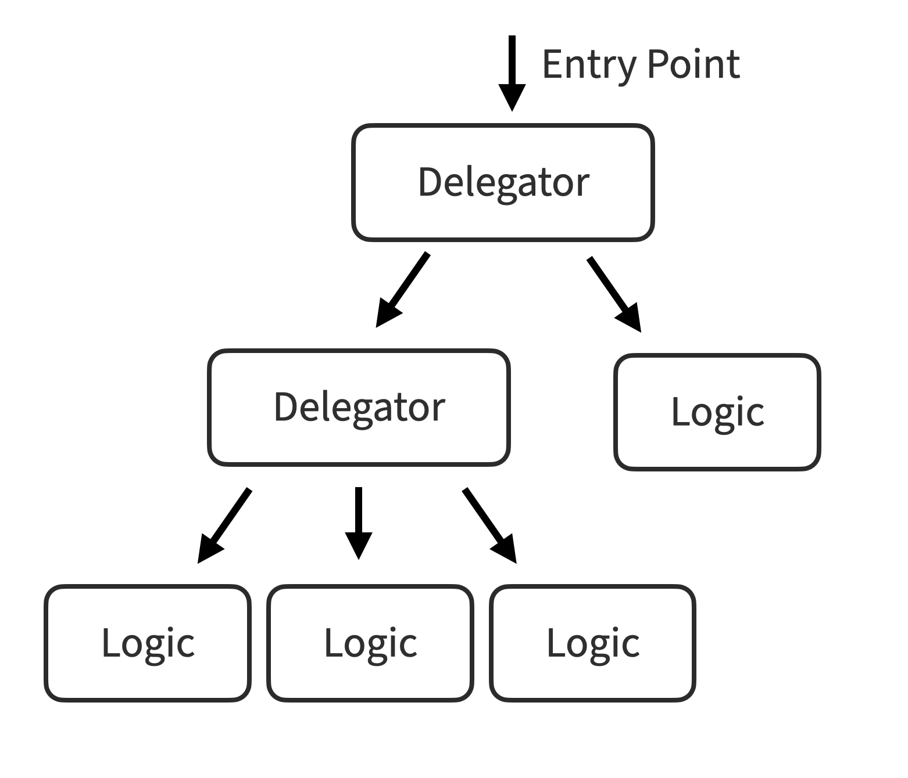

# Glossary of terms

## Argument matcher

When an invocation of a mocked method is compared against its configured
[stubbings](#stub) or [spy verifications](#spy), every argument must pass an
equality check to be said to satisfy the stubbing or verification. In cases
where a test either can't provide arguments that would `==` their actual values
or where the configuration should match a broader range of values, argument
matchers can be used to relax or otherwise augment the process of determining
if a call matches a [demonstration](#demonstration).

Put more explicitly, an argument matcher is a utility method that returns an
object that provides a means of determining if an expected and actual argument
"match" and which the mocking library prioritizes over a default equality
comparison ([source](/src/mocktail/share/determines_matching_calls.rb#L63-L70)).

In Mocktail, argument matchers are provided by its [matcher
API](api.md#matching-arguments-dynamically) invoked via an optional block
parameter passed to the demonstration.

## Arrange-Act-Assert

The three phases of a unit test are said to be "arrange", "act", and "assert".
(In more plainspoken parlance, these are often translated to "given", "when",
and "then".) They refer to the three necessary activities that make a test a
test: setting things up ("arrange"), invoking the [subject under
test](#subject-under-test) ("act"), and verifying the results ("assert").

Because nearly every test does all three things, tools and conventions are often
associated with a particular phase. For example, test fixtures and factories
prepare the prerequisite state of database, so they're normally configured in
the assert phase. Additionally, tests are sometimes made clearer by demarcating
the phases with DSLs (like `let` and `it` RSpec) or a line of whitespace. In
fact, the [rspec-given](https://github.com/rspec-given/rspec-given) library
exists to explicitly map each activity of a test to one of the three phases,
both to better express intention and to take advantage of commonality between
the phases (like memoizing reused setup code).

In the context of Mocktail, mocks are typically created and
[stubbings](#stub) are configured during the arrange phase, while
verifications take place during the assert phase. A notable advantage of
[spies](#spy) over [formal mocks](#mock) is that spies allow for assertion after
the act phase has completed, whereas mocks require assertions to be set up in
the arrange phase (which violates the natural "arrange-act-assert" phase
ordering).

## Command-query separation

Command-query separation refers to a design practice of avoiding methods and
functions that _both_ return a value and have a meaningful side effect. Quoting
its [Wikipedia entry](https://en.wikipedia.org/wiki/Command–query_separation),
"asking a question should not change the answer". Discussing this principle in
the context of mocking is often necessary because there is a tendency for
developers to see a method they know has a necessary return value _and_ an
important side effect and feel an urge to _both [stub](#stub) and
[verify](#spy)_ the same interaction. Whenever that seems like a good idea,
there's a good chance the [dependent method](#dependency) is violating
command-query separation and its design should be revisited.

(Stubbing and verifying the same interaction is never necessary from a test
specification perspective: if the stubbing is necessary for the
[subject](#subject-under-test) to do its work, an additional verification of the
same interaction is redundant.)

## Delegator

A delegator is a unit of code (typically a class in Ruby) that performs its work
primarily by calling through to its [dependencies](#dependency) as opposed to
implementing domain logic itself. In the broader world of software, the vast
majority of domain objects mix delegation and domain logic without much concern
for separating them. When practicing [isolated TDD](#isolated-unit-testing)
rigorously, however, mixing delegation with domain logic makes for especially
painful orchestration of [test doubles](#test-double). As a result, delegators
tend to emerge as a distinct type of unit in a codebase.

Delegators confer a few benefits to a broader codebase:

* They encourage developers to imagine a greater number
of single-purpose units to implement domain logic, making it easier to adhere to
the [single-responsibility
principle](https://en.wikipedia.org/wiki/Single-responsibility_principle)
* Clearly distinguishing between delegators and units that implement domain
logic results in easy-to-navigate, tree-shaped dependency graphs with fewer
cycles (when visualizing dependency graphs, delegators are never leaf nodes in the tree, but implementors of domain logic almost always are)
* Because delegators essentially _only_ interact with other application-defined
units, they operate at a single [level of abstraction](#level-of-abstraction)
and make it easier for each unit to which they delegate to also operate at
a single level of abstraction

To illustrate, a dependency graph resulting from outside-in isolated TDD  will
often look like this, with only as many layers of delegators as are necessary to
identify single-purpose units to implement domain logic:

<p align="center" width="100%">
  
</p>

## Demonstration

Mocktail's API was designed so that you could configure a [stubbing](#stub) or
[spy verification](#spy) by invoking a mocked [dependency](#dependency)'s method
_exactly_ as the subject would. This has two benefits: reducing the mental
overhead of keeping a larger mocking API straight and increasing the
find-and-replaceability of your code. We call that invocation used to configure
the mock a "demonstration", because the test is demonstrating how it expects
the mocked method to be called.

For example, in the following stubbing:

```ruby
stubs { @highball.stir(times: 3) }.with { :bubbles }
```

The mock `@highball` has its `stir` method stubbed with the return value
`:bubbles` when it is invoked as demonstrated above.

Or this verification:

```ruby
verify { @highball.drink!(speed: SIPPING) }
```

In this case, `@highball.drink!(speed: SIPPING)` is a demonstration of the call
we expect to the subject to invoke.


## Dependency

In [isolated unit testing](#isolated-unit-testing), a "dependency" almost always
refers to a plain ol' Ruby class for which one or more instances are depended on
by a [subject under test](#subject-under-test).

This usage of the word "dependency" in the context of unit testing with mocking
libraries stands in contrast to most others, where the word most often refers to
third-party libraries and frameworks (usually distributed as Ruby gems) or to
networked services (e.g. an HTTP API). In this use, an integrated application or
project is implied as the thing depending on the dependency.

In Gerard Mezsaros' XUnit Patterns, he referred to dependencies less ambiguously
as [depended-on components (DOC)](http://xunitpatterns.com/DOC.html).

## Isolated unit testing

Isolated unit testing (also known as "mockist", "London-school" test-driven
development, or discovery testing) was most thoroughly defined in Steve Freeman
and Nat Pryce's book [Growing Object-Oriented Software, Guided by
Tests](https://www.amazon.com/Growing-Object-Oriented-Software-Guided-Tests/dp/0321503627).
Whereas traditional test-driven development often builds systems "bottom-up" by
starting with units that implement domain logic (leaving the ultimate
composition of dependencies up to the individual to compose or extract
manually), isolated TDD starts "outside-in" and it results in the decomposition
of a big problem into small units as a matter of course.

In simplest terms, an isolated unit test exercises the behavior of the
[subject](#subject-under-test) but not of any of its dependencies, instead
replacing all of them at runtime with alternatives controlled by the test. This
puts the subject under extreme isolation, allowing the tester to:

* Test the subject's behavior without invoking the behavior of its
[dependencies](#dependency) and thereby introducing a transitive dependency on
them
* Assert or observe the subject's behavior directly, as opposed to measuring
the a return value or a side effect of a dependency
* validate the design of the contracts between the subject and its dependencies
by responding to the pain of stubbing and verifying any interactions with the
dependencies, because (assuming an expressive mocking library) API contracts
that are hard to fake are generally also hard to use

Code that results from isolated test-driven development tends to result in
separate classes of units: one that breaks down the work
([delegators](#delegator)) and another that implements a single aspect of the
work work as single-purpose units. This approach is typified by tree-shaped
designs that branch from the program's entry point into a set of delegators and
a larger number of implementation objects as leaf nods—many of them behaving as
pure functions.

## Level of Abstraction

The phrase "level of abstraction" is both ironically and inherently amorphous,
because it refers to a conceptual [layer of
concepts](https://en.wikipedia.org/wiki/Abstraction_layer). The term is most
often used in the context of the exhortation "don't mix levels of abstraction",
which is even harder to pin down a meaning to.

To clarify the term for the purpose of a discussion of [isolated unit
testing](#isolated-unit-testing), consider a level of abstraction as "the
classification of things a unit of code interacts with". For example, imagine
units of code as interacting with one or more of these "levels" of abstraction:

1. Primitive booleans, strings, numbers
2. Collections of multiple primitives
3. Value objects containing primitives and collections
4. Implementers of domain logic that operate on [value objects](#value)
5. [Delegators](#delegator) of implementers of domain logic

When practicing outside-in test-driven development, testing
[subjects](#subject-under-test) operating on that 5th level of abstraction is
the only layer for which mocking out dependencies has a clear, valuable purpose.
Moreover, if such a subject _also_ interacts significantly with layers 1-4, the
test will generally be painful to write, because the [test double](#test-double)
configuration will be more complicated. As a result, practicing outside-in TDD
and responding to testing pain by adjusting the design of the production code
will often result in delegator objects that do nothing but delegate their work
up to other units that implement domain logic as opposed to _mixing levels
of abstraction_ in their implementation.

## Mock

A mock is a specific type of [test double](#test-double) that is typified by
having any expected invocations specified _in advance_ of invoking the
[subject](#subject-under-test) (that is, during the [arrange
phase](#arrange-act-assert), as opposed to the assertion phase). Typically, a
mock would be configured, the subject invoked, and then the mock would be called
to verify that its expectations were met.

Mocktail creates test doubles that perform validation as [spies](#spy), but
Minitest ships with `Minitest::Mock`, which implements traditional mocking
behavior:

```ruby
mock = Minitest::Mock.new
mock.expect(:some_method, :some_arg)

subject.do_stuff(mock)

mock.verify
# => if `mock.some_method(:some_arg)` is not called, will raise:
#      MockExpectationError: "expected some_method() => :some_arg"
```

Mock objects were popularized in the [Extreme
Programming](https://en.wikipedia.org/wiki/Extreme_programming) community by
Steve Freeman and others, with their paper on what they termed
"[Endotesting](https://www2.ccs.neu.edu/research/demeter/related-work/extreme-programming/MockObjectsFinal.PDF)" at the XP 2000 conference.
Mocking was the dominant method of verifying behavior with test doubles until
2010, as [test spies](#spy) began to pick up more steam, thanks to the
popularity of Java's [Mockito](https://site.mockito.org) and
[Jasmine](https://jasmine.github.io/api/edge/global.html#spyOn) in JavaScript.

## Partial mock

A partial mock is a [test double](#test-double) that replaces some, but not all,
of its real functionality with fake functionality. This could refer to its
state, behavior, or some combination of both. Partial mocks are generally
considered an antipattern, for several reasons:

* [Isolated tests](#isolated-unit-testing) are designed to establish clear boundaries between a
[subject](#subject-under-test) and its [dependencies](#dependency), so drawing
that border somewhere in the middle of one of the dependencies represents an
inherently unclear boundary
* Whenever a real method on a partial mock calls a fake method on itself, the
test author needs to concern themselves with any stubbing and verifying
happening within the internals of a dependency (as opposed to the subject being
tested itself), and because those implementation details can change at any time,
the test of an unrelated subject that is facially isolated from the partial mock
could very likely fail
* It is perhaps not-so-surprisingly very easy for internal state held by partial
mocks to enter undefined states, leading to behavior that's completley unlike
how their "real" methods will behave in production, so their perceived realness
is often illusory

Even when things are kept very simple, mocking is poorly understood and leads to
a lot of confusion, so the increase in complexity represented by partial mocks
results in test-scoped code that's very difficult to read and understand how it
is behaving and what that behavior _means_ in terms of what assurances are being
provided by the test.

## Proxy

In the context of mocking, the word proxy most often describes a [test
doubles](#test-double) that records all interactions made against its methods
(like a [spy](#spy)), but unlike every other kind of test double, proceeds to
call through to the _actual_ implementation of the dependency. This can be seen
as having the best of both worlds (verifying interactions without violating
their veracity), but more often results in tests make unnecessarily many
assertions and promotes the design of code that overly relies on side effects
over pure functions.

Proxies aren't especially common in mocking libraries, but can be found in rr's
[mock.proxy](https://github.com/rr/rr/blob/master/doc/03_api_overview.md#mockproxy)
API and, in JavaScript, with Jasmine spies'
[callThrough()](https://jasmine.github.io/api/edge/SpyStrategy.html) function.


## Spy

A spy is a special sub-type of a [test double](#test-double) that describes a
fake object that silently records all invocations made against it and provides a
way for a test to interrogate those interactions in the
[assert](#arrange-act-assert) phase. The term "[test
spy](http://xunitpatterns.com/Test%20Spy.html)" was first coined by Gerard
Mezsaros for his book [XUnit
Patterns](https://www.amazon.com/xUnit-Test-Patterns-Refactoring-Code/dp/0131495054/).

The "mock" methods created by Mocktail can behave as both spies and
[stubs](#stub), as they allow after-the-fact assertion and introspection via the
[verify](../support/api.md#mocktailverify) DSL method. (This approach also
enabled debugging utilities like
[Mocktail.explain](../support/api.md#mocktailexplain) and
[Mocktail.calls](../support/api.md#mocktailcalls).)

In general, interactions should only be verified explicitly when the
[dependency](#dependency) triggers a side effect that doesn't return a
meaningful value that is able to be observed by the
[subject](#subject-under-test)'s ultimate result. In such a case, a spy
is used like this:

```ruby
copy_machine = Mocktail.of(CopyMachine)
subject = Accountant.new

subject.record(:secret_stuff, with: copy_machine)

verify { copy_machine.copy(:secret_stuff) }
# => if `copy_machine.copy` was invoked with `:secret_stuff`, nothing happens.
# Otherwise, it raises Mocktail::VerificationError:
#
# Expected mocktail of `CopyMachine#copy' to be called like:
#
#   copy(:secret_stuff)
#
# But it was never called.
```

## Stub

In mocking parlance, a "stub" is a specific type of a [test
double](#test-double) wherein a function or method is configured in the
[arrange](#arrange-act-assert) phase of an [isolated
test](#isolated-unit-testing) to respond with a particular value (or raise a
particular error). A particular stubbing (that is, a preconfigured response)
might be applied to all invocations of the stubbed method, or made to depend on
the arguments provided.

The purpose of stubbing is to facilitate downstream behavior in the
[subject](#subject-under-test) by configuring an artificial response (return
values or errors) in a test double of a [dependency](#dependency). Mocktail's
"mocks" can be used as both stubs and [spies](#spy), so here's an example
using its [stubs](api.md#mocktailstubs) DSL method:

```ruby
peeler = Mocktail.of(Peeler)
subject = Bartender.new(peeler)
stubs { peeler.peel(:orange) }.with { :peeled_orange }
stubs { peeler.peel(:lemon) }.with { :peeled_lemon }

result = subject.prep([:orange, :lemon])

assert_equal [:peeled_orange, :peeled_lemon], result
```

In the example above, the two `stubs` merely enable the `Bartender` subject to
do its job (of invoking `peel` on each element passed to it). Because the stubs'
configuration will only return the `:peeled_` symbols if passed the correct
argument, no explicit assertion that the calls occurred is necessary. Since
calling `peeler.peel(:grape)` would return nil, the above stubbing is sufficient
to verify the dependency was invoked appropriately.

## Subject under test

The [subject under test](http://xunitpatterns.com/SUT.html) (or "subject") was
coined by Gerard Meszaros in his book [XUnit
Patterns](https://www.amazon.com/xUnit-Test-Patterns-Refactoring-Code/dp/0131495054/)
to refer to the _thing being tested_. That's all. Nothing too fancy!

In order to promote easier extract refactors, some developers like to assign the
subject under test to a variable name like `@subject` in every test so that test
cases can be moved between file listings with less effort. It has the added
benefit of always clarifying the thing being tested from any other
[dependencies](#dependency) referenced in the test.

## Test double

A test double is a catch-all term for a fake object meant to stand-in for a real
thing. The name is meant to evoke the image of a stunt double who stands in for
the real actor in your tests. It was coined by Gerard Meszaros in his [book
XUnit patterns](http://xunitpatterns.com/Test Double.html). Technically, the
mocks generated by Mocktail would be most correctly described not as mocks at
all, but as "combination stubs and spies" in proper parlance, but outside a very
tiny group of people who write mocking libraries, the distinctions have turned
out to not be sufficiently meaningful to teach people half a dozen special words
for what everyone colloquially prefers to call a "mock".

([Test Double](https://testdouble.com) is also the name of a
pretty great software consultancy with strong ties to the Ruby community and
which incidentally created and maintains Mocktail.)

## Value

Similar to how [isolated TDD](#isolated-unit-testing) tends to lead to a sharp
distinction between [delegators](#delegator) that break up the work and small
units to implement it, struct-like objects to represent values also emerge as
distinct from objects that contain domain logic that implements features.

Because delegators typically only hold references to their
[dependencies](#dependency) and are otherwise stateless, their public methods
tend to receive value objects. Values essentially become the
"unit of work", and are passed elsewhere, wrapped, transformed, or mutated, and
returned. Values typically contain primitive data (e.g. booleans, strings, etc.),
other values, and methods that merely _elucidate_ the data they hold as opposed
to implementing feature logic.

In Ruby, values are most often implemented as
[Struct](https://docs.ruby-lang.org/en/master/Struct.html),
[Data](https://docs.ruby-lang.org/en/master/Data.html), or (in Sorbet)
[T::Struct](https://sorbet.org/docs/tstruct).

## Wrapper object

A wrapper object, sometimes referred to as an adapter (or even "[scar
tissue](https://www.destroyallsoftware.com/talks/boundaries)") is often
introduced to wrap code whose API can't be readily changed in response to being
difficult to mock out in a test (e.g. a third-party library, a utility
maintained by another team, etc). Wrappers typically act as a solitary
chokepoint for an application's use of a third-party API, which can serve a
couple of key benefits:

* Wrappers self-document the extent to which a codebase uses a particular
dependency and make it easy to assess swapping it for an alternative without
requiring changes to be made throughout the codebase
* If a wrapper is written around a hard-to-mock (and therefore hard-to-use)
third-party API, then the wrapper can effectively serve as a rug under which the
complexity of that API can be swept by exposing its behavior through
easier-to-mock (and therefore easier-to-use) method signatures and return values
that look and feel similar to those found in the rest of the codebase
